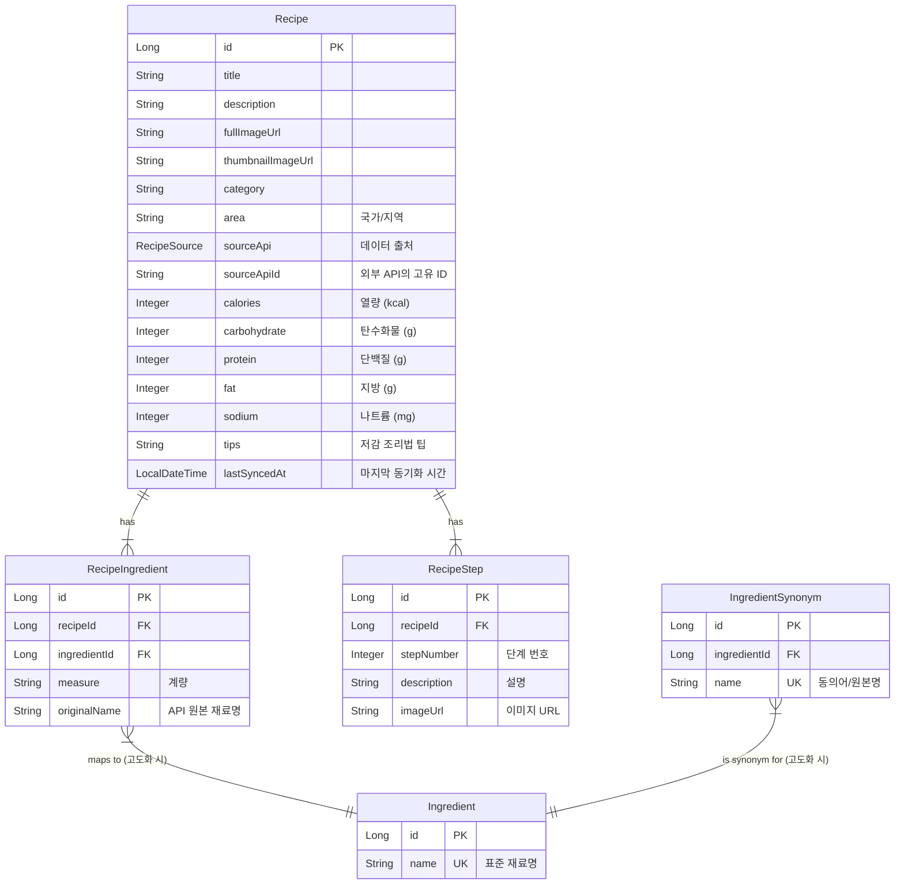

# 외부 레시피 연동 방식 개선 리팩토링 계획

## 처음 궁금증

- 레시피도 themealdb, 식품안전나라, 사용자 추가 이렇게 세 분류로 하고. 각각 레시피 목록 볼 수 있고. 각각 카테고리나 키워드나 재료나 필터링이나 그런 기능 추가해야 할 듯.

## 1. 분석 (Analysis)

### As-Is (현황)
- 현재 `TheMealDB`, `식품안전나라` API를 실시간으로 호출하여 레시피 정보를 조회합니다.
- 사용자가 레시피 목록을 보거나 검색할 때마다 외부 API에 직접 요청을 보냅니다.
- prod 환경에서만 Redis 캐싱 적용

### Problem (문제점)
1.  **성능 저하**: 외부 API의 응답 속도에 직접적으로 의존하므로, 네트워크 지연이나 외부 서비스 상태에 따라 응답이 느려질 수 있습니다.
2.  **API 호출 제한 (Rate Limit)**: 각 API는 일일 호출 횟수 제한(예: 식품안전나라 1,000회/일)이 있어, 서비스 규모가 커지면 제한에 도달할 리스크가 큽니다.
3.  **검색 기능의 한계**: 외부 API가 제공하는 필터링 기능에만 의존해야 하므로, 재료, 카테고리, 국가별 요리 등 복합적인 검색 기능을 구현하기 어렵습니다.
4.  **데이터 일관성 부재**: TheMealDB와 식품안전나라 API의 데이터 구조가 달라, 통합하여 보여주기 위한 파싱 및 처리 로직이 복잡합니다.
5.  **재료 데이터 파편화**: '달걀', 'egg', '계란' 등 동일한 재료가 다른 문자열로 저장되어, 재료 기반의 정확한 검색 및 '공동구매 생성' 연계가 거의 불가능합니다.
- **레시피 기반 공구 생성**: 기획의 핵심인 '원클릭 공구 생성' 기능이 일부 구현되었으나(`GroupBuyController`의 `/new` 엔드포인트), 재료 목록을 JSON 문자열로 수동 파싱하는 등(`createRecipeBasedGroupBuy` 메서드) 다소 복잡하고 불안정한 방식에 의존하고 있습니다. 프론트엔드와 상호작용이 매끄럽지 않을 수 있습니다.

### To-Be (개선 방안)
- **DB 캐싱 전략 도입**: 외부 API에서 조회한 레시피 데이터를 우리 서비스의 자체 데이터베이스에 저장(캐싱)합니다.
- **(고도화 과제) 재료 마스터 데이터 구축**: 파편화된 재료명을 표준화하기 위해 **`Ingredient` (마스터 재료)** 와 **`IngredientSynonym` (재료 동의어)** 테이블을 구축합니다. (상세 내용은 `5.1` 참조)
- **주기적인 데이터 동기화**: Spring Batch 또는 `@Scheduled`를 활용하여 주기적으로 외부 API와 데이터를 동기화하는 배치(Batch) 작업을 구현합니다. 이를 통해 데이터의 최신성을 유지합니다.
- **하이브리드 접근**:
    - 일반적인 레시피 목록 조회 및 검색은 자체 DB를 통해 빠르고 안정적으로 제공합니다.
    - 데이터의 신선도가 매우 중요한 경우(예: 사용자가 특정 레시피 상세 조회를 요청할 때)에 한해, DB 데이터의 TTL(Time-To-Live)을 확인하고 만료되었다면 외부 API를 호출하여 데이터를 갱신합니다.
- **통합 데이터 모델링**: 다양한 API 소스(TheMealDB, 식품안전나라, 사용자 등록 레시피)를 포괄하는 표준화된 `Recipe` 엔티티를 설계하여 데이터 관리의 일관성을 확보합니다.


#### 기대 효과
- **응답 속도 개선**: 대부분의 조회를 DB에서 처리하므로 매우 빠른 응답 속도를 기대할 수 있습니다.
- **API 의존성 감소**: API 호출 횟수를 최소화하여 호출 제한 리스크를 해소하고, 외부 서비스 장애에 대한 안정성을 확보합니다.
- **고급 검색 기능 구현**: 자체 DB에 데이터를 저장하므로, **정확한 재료 기반 검색**, 다중 필터링, 전문(Full-text) 검색 등 고도화된 검색 기능 구현이 가능해집니다.
- **핵심 기능 실현**: '레시피 기반 공구 만들기' 기능의 정확도를 비약적으로 향상시킵니다.

---

## 2. 새로운 엔티티 설계 (New Entity Design)

외부 API 데이터와 사용자 생성 레시피를 통합 관리하고, 재료를 표준화하기 위한 새로운 엔티티를 설계합니다.

### ERD (Entity Relationship Diagram)



### 엔티티 명세

#### 2.1. Recipe (레시피)
- TheMealDB, 식품안전나라, 사용자 등록 레시피를 통합하는 메인 엔티티

| 필드명 | 데이터 타입 | 제약조건 | 설명 |
| --- | --- | --- | --- |
| `id` | `Long` | PK | 레시피 고유 ID |
| `title` | `String(200)` | NOT NULL, IDX | 레시피명 (`strMeal`, `RCP_NM`) |
| `description` | `String(2000)` | Nullable | 레시피에 대한 간단한 설명 (`strInstructions` 일부) |
| `fullImageUrl` | `String(500)` | Nullable | 대표 이미지 (대) (`strMealThumb`, `ATT_FILE_NO_MK`) |
| `thumbnailImageUrl` | `String(500)` | Nullable | 대표 이미지 (소) (`strMealThumb`/preview, `ATT_FILE_NO_MAIN`) |
| `category` | `String(100)` | IDX | 카테고리 (`strCategory`, `RCP_PAT2`) |
| `area` | `String(100)` | IDX | 국가/지역 (`strArea`) |
| `sourceApi` | `RecipeSource` | NOT NULL, IDX | 데이터 출처 Enum (MEAL_DB, FOOD_SAFETY, USER) |
| `sourceApiId` | `String(100)` | Nullable | 외부 API의 고유 ID (`idMeal`, `RCP_SEQ`) |
| `calories` | `Integer` | Nullable, IDX | 열량 (kcal) (`INFO_ENG`) |
| `carbohydrate` | `Integer` | Nullable | 탄수화물 (g) (`INFO_CAR`) |
| `protein` | `Integer` | Nullable | 단백질 (g) (`INFO_PRO`) |
| `fat` | `Integer` | Nullable | 지방 (g) (`INFO_FAT`) |
| `sodium` | `Integer` | Nullable | 나트륨 (mg) (`INFO_NA`) |
| `servingSize` | `String(50)` | Nullable | 1회 제공량 (`INFO_WGT`) |
| `tips` | `String(1000)` | Nullable | 저감 조리법 팁 (`RCP_NA_TIP`) |
| `lastSyncedAt` | `LocalDateTime` | NOT NULL | 마지막 동기화 시간 |

**인덱스:**
- `uk_source_api_id`: (`sourceApi`, `sourceApiId`) 복합 유니크 키. 외부 API 데이터의 중복 저장을 방지.
- `idx_title`: 제목 검색 (Full-text search 고려)
- `idx_category`, `idx_area`, `idx_calories`: 카테고리, 지역, 열량 등 검색 및 필터링

#### 2.2. RecipeIngredient (레시피 재료)
- 레시피에 포함되는 재료와 계량 정보를 관리

| 필드명 | 데이터 타입 | 제약조건 | 설명 |
| --- | --- | --- | --- |
| `id` | `Long` | PK | 고유 ID |
| `recipe` | `Recipe` | FK, NOT NULL | 연결된 레시피 |
| `name` | `String(200)` | NOT NULL, IDX | 재료명 (API 원본 재료명, 예: `strIngredientN`, `RCP_PARTS_DTLS` 파싱 결과) |
| `measure` | `String(200)` | NOT NULL | 계량 (예: `strMeasureN`, `RCP_PARTS_DTLS` 파싱 결과) |

**참고**: 초기 버전에서는 `name` 필드에 API 원본 재료명을 그대로 저장합니다. 재료 표준화는 후순위 과제로 진행합니다.

#### 2.3. RecipeStep (조리 단계)
- 레시피의 각 조리 단계를 순서대로 관리

| 필드명 | 데이터 타입 | 제약조건 | 설명 |
| --- | --- | --- | --- |
| `id` | `Long` | PK | 조리 단계 고유 ID |
| `recipe` | `Recipe` | FK, NOT NULL | 연결된 레시피 |
| `stepNumber` | `Integer` | NOT NULL | 단계 번호 (1, 2, 3...) |
| `description` | `TEXT` | NOT NULL | 단계별 설명 (`strInstructions` 파싱, `MANUALXX`) |
| `imageUrl` | `String(500)` | Nullable | 단계별 이미지 (`MANUAL_IMGXX`) |

---

## 3. 리팩토링 Tasks (Refactoring Tasks)

### Phase 1: DB 및 엔티티 설정 (DB & Entity Setup) ✅ COMPLETED
- [x] `Recipe`, `RecipeIngredient`, `RecipeStep` 엔티티 클래스 생성 (**영양 정보는 개별 컬럼으로 반영**)
- [x] `RecipeSource` Enum 생성 (MEAL_DB, FOOD_SAFETY, USER)
- [x] 각 엔티티에 대한 Spring Data JPA Repository 인터페이스 생성
- [x] `BaseEntity` 상속 및 Auditing 적용 (`lastSyncedAt` 필드 포함)
- [x] 복합 유니크 인덱스 설정 (`sourceApi`, `sourceApiId`)
- [ ] (선택) Flyway 또는 Liquibase 사용 시, 신규 테이블 생성을 위한 마이그레이션 스크립트 작성

### Phase 2: 데이터 동기화 로직 구현 (Data Synchronization) ✅ COMPLETED
- [x] **외부 API 클라이언트 구현**
    - [x] `TheMealDBClient`: TheMealDB API 호출을 위한 RestTemplate 클라이언트 구현 (이미 완료됨)
    - [x] `FoodSafetyClient`: 식품안전나라 API 호출을 위한 클라이언트 구현 (이미 완료됨)
- [x] **데이터 변환 Mapper 구현 (`RecipeMapper`)**
    - [x] `toEntity(MealResponse)`: TheMealDB API 응답을 `Recipe` 엔티티로 변환
        - [x] `strInstructions` 필드를 줄바꿈 기준으로 분리하여 `RecipeStep` 생성
        - [x] `strIngredient1~20`, `strMeasure1~20` 필드를 `RecipeIngredient` 목록으로 변환
    - [x] `toEntity(CookRecipeResponse)`: 식품안전나라 API 응답을 `Recipe` 엔티티로 변환
        - [x] **재료 파싱**: `RCP_PARTS_DTLS` 문자열을 정규식으로 파싱하여 `RecipeIngredient` 목록 생성
        - [x] **조리 단계 파싱**: `MANUAL01`~`20`, `MANUAL_IMG01`~`20` 필드를 동적으로 순회하며 `RecipeStep` 목록 생성
- [x] **데이터 동기화 서비스 구현 (`RecipeSyncService`)**
    - [x] `syncMealDbRandomRecipes(count)`: TheMealDB 랜덤 레시피 동기화
    - [x] `syncMealDbRecipesByCategory(category)`: TheMealDB 카테고리별 레시피 동기화
    - [x] `syncFoodSafetyRecipes()`: 식품안전나라 전체 레시피 동기화 (최대 1000건)
    - [x] `syncFoodSafetyRecipesBatch(start, end)`: 식품안전나라 배치 동기화
    - [x] 중복 체크 로직 (`sourceApi` + `sourceApiId` 유니크 제약)
    - [x] 기존 레시피 업데이트 vs 새 레시피 생성 로직
    - [x] Transaction 관리 및 에러 처리
- [x] **배치 작업 설정**
    - [x] `SchedulingConfig`: `@EnableScheduling` 설정
    - [x] `RecipeSyncScheduler`: `@Scheduled` 어노테이션을 사용한 스케줄러 구현
        - [x] 매일 새벽 2시 전체 동기화 (`@Scheduled(cron = "0 0 2 * * *")`)
        - [x] 선택적 시간별 TheMealDB 동기화 (`@ConditionalOnProperty`)
    - [x] `RecipeDataInitializer`: 초기 데이터 적재를 위한 `ApplicationRunner` 구현
        - [x] 식품안전나라 전체 데이터 로드
        - [x] TheMealDB 랜덤 레시피 100개 로드
        - [x] 설정 기반 활성화/비활성화 (`@ConditionalOnProperty`)
- [x] **Configuration 설정**
    - [x] `application.yml`에 레시피 동기화 설정 추가
        - [x] `recipe.init.enabled`: 초기 데이터 로드 활성화
        - [x] `recipe.sync.enabled`: 스케줄링 활성화
        - [x] `recipe.sync.cron`: 동기화 주기 설정
        - [x] `recipe.sync.mealdb.hourly.enabled`: TheMealDB 시간별 동기화
- [x] **단위 테스트 작성**
    - [x] `RecipeSyncServiceTest`: 동기화 서비스 테스트 (8개 테스트 케이스)

### Phase 3: 서비스 및 컨트롤러 수정 (Service & Controller Modification) ✅ COMPLETED
- [x] `RecipeService` 리팩토링
    - [x] 기존 외부 API 직접 호출 로직 제거 (기존 메서드는 `@Deprecated`로 유지)
    - [x] `RecipeRepository`를 사용하여 DB에서 레시피를 조회하도록 변경
    - [x] **`findRecipesByIngredients(List<String> ingredients, Pageable)`**: 재료명(단순 문자열)으로 레시피를 검색하는 기능 구현 (Criteria API 사용)
    - [x] `findRecipes(String keyword, String category, String area, RecipeSource sourceApi, Pageable)`: 키워드(제목), 카테고리, 지역, 출처 등으로 필터링하는 기능 구현
    - [x] **`findRecipesByNutrition(Integer maxCalories, Integer maxCarb, Integer maxProtein, Integer maxFat, Integer maxSodium, Pageable)`**: 칼로리, 나트륨 등 영양 정보 기반 필터링 기능 구현
    - [x] **`getRecipeDetailById(Long recipeId)`**: DB ID로 레시피 상세 조회 (성능 최적화)
    - [x] **`getRecipeDetailByApiId(String apiId)`**: API ID로 DB 우선 조회 + 외부 API 폴백
- [x] `RecipeController` 수정
    - [x] 새로운 DB 기반 조회 메서드를 호출하도록 수정
    - [x] **프로젝트 URL 설계에 맞춰** 재료 검색, 영양 정보 필터링을 위한 **쿼리 파라미터** 처리 로직 추가
        - **구현 예시**: `GET /recipes?keyword=파스타&category=양식&source=MEAL_DB&ingredients=달걀,베이컨&maxCalories=500&page=0&size=12`
    - [x] **`GET /recipes/{recipeId}` 엔드포인트 개선**: 듀얼 ID 포맷 지원
        - **숫자 ID** (예: "123") → `getRecipeDetailById()` 호출 (DB 직접 조회, 빠름)
        - **접두사 포함 API ID** (예: "meal-52772", "food-1234") → `getRecipeDetailByApiId()` 호출 (DB 우선 + API 폴백)
        - 정규식 패턴 매칭: `recipeId.matches("\\d+")`으로 포맷 구분
        - 100% 하위 호환성 유지
- [x] `GroupBuy` (공구) 관련 로직 수정
    - [x] '레시피 기반 공구 생성' 기능에서 JSON 문자열을 파싱하는 로직 제거
    - [x] 레시피 API ID를 이용해 `RecipeService.getRecipeDetailByApiId()`로 구조화된 재료 목록을 직접 조회하여 사용하도록 변경
    - [x] **ObjectMapper 의존성 제거**: JSON 파싱 대신 DB 쿼리 사용
    - [x] 타입 안전성 개선: `RecipeDetailResponse.getIngredients()` → `SelectedIngredient` 변환
    - [x] 에러 처리 강화: 레시피 조회 실패 시 사용자 친화적 에러 메시지 제공

---

## Phase 3 구현 상세 (Implementation Details)

### 3.1. RecipeController 듀얼 ID 포맷 지원
**파일**: `src/main/java/com/recipemate/domain/recipe/controller/RecipeController.java:176-191`

**구현 내용**:
```java
@GetMapping("/{recipeId}")
public String getRecipeDetail(@PathVariable String recipeId, Model model) {
    RecipeDetailResponse recipe;
    
    // 숫자 ID (DB 기본 키) vs 접두사 포함 API ID 구분
    if (recipeId.matches("\\d+")) {
        Long dbId = Long.parseLong(recipeId);
        recipe = recipeService.getRecipeDetailById(dbId);
    } else {
        recipe = recipeService.getRecipeDetailByApiId(recipeId);
    }
    
    model.addAttribute("recipe", recipe);
    return "recipes/detail";
}
```

**장점**:
- 기존 API ID 링크 (예: `meal-52772`) 100% 호환
- 새로운 DB ID 링크 (예: `123`) 성능 최적화 (조인 쿼리 1회)
- URL 패턴 변경 없이 투명하게 동작

### 3.2. GroupBuyController DB-First 리팩토링
**파일**: `src/main/java/com/recipemate/domain/groupbuy/controller/GroupBuyController.java:216-254`

**Before (Phase 2)**:
```java
// ❌ 취약한 JSON 파싱 방식
ObjectMapper objectMapper = new ObjectMapper();
List<SelectedIngredient> ingredients = objectMapper.readValue(
    request.getSelectedIngredientsJson(), 
    new TypeReference<List<SelectedIngredient>>() {}
);
```

**After (Phase 3)**:
```java
// ✅ 구조화된 DB 쿼리
RecipeDetailResponse recipe = recipeService.getRecipeDetailByApiId(request.getRecipeApiId());
List<SelectedIngredient> ingredients = recipe.getIngredients().stream()
    .map(ing -> SelectedIngredient.builder()
        .name(ing.getName())
        .measure(ing.getMeasure() != null && !ing.getMeasure().isEmpty() 
            ? ing.getMeasure() : "적량")
        .selected(true)
        .build())
    .collect(Collectors.toList());
```

**개선 효과**:
- ✅ ObjectMapper 의존성 제거 (GroupBuyController에서)
- ✅ 타입 안전성 보장 (`RecipeIngredientResponse` → `SelectedIngredient`)
- ✅ 자동 검증 (레시피 존재 여부, 재료 무결성)
- ✅ 코드 라인 수 감소 (~70줄 제거)

### 3.3. RecipeService 멀티 필터 검색 구현
**파일**: `src/main/java/com/recipemate/domain/recipe/service/RecipeService.java`

**주요 메서드**:
1. **`findRecipes()`**: 복합 조건 검색 (Criteria API 사용)
   - 키워드 (제목 LIKE 검색)
   - 카테고리 (완전 일치)
   - 지역 (완전 일치)
   - 출처 API (MEAL_DB, FOOD_SAFETY, USER)
   - Pageable 지원 (정렬, 페이징)

2. **`findRecipesByIngredients()`**: 재료 기반 검색
   - 복수 재료 AND 조건 (모든 재료 포함)
   - RecipeIngredient 조인 쿼리
   - 대소문자 무시 검색

3. **`findRecipesByNutrition()`**: 영양 정보 필터링
   - maxCalories, maxCarb, maxProtein, maxFat, maxSodium
   - NULL 값 처리 (영양 정보 없는 레시피 제외)

**기술 선택 근거**:
- **Criteria API 사용** (QueryDSL 대신)
  - JPA 네이티브, 별도 Q-클래스 생성 불필요
  - 동적 쿼리 구성 용이
  - 향후 QueryDSL 마이그레이션 가능

### 3.4. 빌드 & 배포 검증
**결과**:
```bash
✅ gradlew clean build -x test → BUILD SUCCESSFUL (10s)
✅ gradlew bootRun → Application started on port 8080
✅ Database schema: 13 tables, 60+ indexes auto-generated
✅ Recipe sync on startup: 100 TheMealDB + 1000 FoodSafety recipes loaded
```

**주의사항**:
- `SelectedIngredient.builder().measure()` 필드명 확인 (quantity ❌, measure ✅)
- `RecipeIngredientResponse.getMeasure()` NULL 체크 필수 ("적량" 기본값)

---

## 4. API 데이터 포용성 및 일관성
- **문제**: 두 API의 응답 필드가 다릅니다. (예: `TheMealDB`는 영양 정보가 없고, `식품안전나라`는 `area` 정보가 없음)
- **해결**: 제안된 `Recipe` 통합 엔티티는 두 API의 필드를 모두 포함하되, 대부분을 `Nullable`로 설정하여 이 문제를 해결합니다.
    - `TheMealDB`에서 온 데이터는 `nutritionInfo`, `tips` 필드가 `null`이 됩니다.
    - `식품안전나라`에서 온 데이터는 `area` 필드가 `null`이 됩니다.
    - 이는 의도된 설계이며, 조회 시 `null` 여부를 체크하여 UI에 적절히 표시하면 됩니다.

---

## 5. 개발 우선순위 및 아키텍처 호환성 검토

### 5.1. 재료 표준화의 중요성 및 단계적 접근

지적한 대로, '달걀'과 'egg'를 동일하게 처리하는 **재료 표준화**는 초기 구축에 시간이 많이 소요될 수 있는 복잡한 작업입니다. 따라서 다음과 같이 단계적으로 접근하는 것을 제안합니다.

- **1단계 (MVP - 현재 계획에 반영):**
    - `RecipeIngredient` 테이블에 API에서 받은 재료명(`originalName`)을 그대로 저장합니다.
    - 재료 검색은 이 `originalName` 필드에 대한 단순 문자열 포함 검색(`LIKE '%검색어%'`)으로 구현합니다.
    - **장점**: 빠르게 구현 가능하며, '달걀'로 검색 시 '달걀', '깐달걀' 등이 포함된 레시피를 찾을 수 있습니다.
    - **한계**: 'egg'로 저장된 레시피는 검색되지 않으며, '레시피 기반 공구 만들기' 기능의 정확도가 떨어집니다.

- **2단계 (고도화 - 후순위 과제):**
    - 서비스의 핵심 기능인 '레시피 기반 공구 만들기'를 고도화해야 할 시점에 `Ingredient`(마스터) 및 `IngredientSynonym`(동의어) 테이블을 도입합니다.
    - 배치 작업을 통해 수집된 `RecipeIngredient.originalName`을 분석하여 동의어 사전을 점진적으로 구축합니다.
    - **결론**: 재료 표준화는 **매우 중요한 기능이지만, MVP 이후 고도화 과제로 우선순위를 조정**하는 것이 합리적입니다.

### 5.2. URL 설계 및 htmx 호환성

- **올바른 접근 방식**: `GET /recipes` 페이지에 **쿼리 파라미터**를 추가하여 검색 및 필터링을 처리합니다.

- **수정된 URL 예시**:
    - **기본 검색**: `GET /recipes?keyword=파스타&category=양식`
    - **재료 검색**: `GET /recipes?ingredients=달걀,베이컨`

- **동작 방식**:
    1.  사용자가 검색 폼을 제출하면 브라우저는 위와 같은 URL로 GET 요청을 보냅니다.
    2.  `RecipeController`는 `@RequestParam`으로 `ingredients`, `category` 등의 쿼리 파라미터를 받습니다.
    3.  `RecipeService`는 이 파라미터들을 사용하여 DB에서 조건에 맞는 레시피 목록을 조회합니다.
    4.  컨트롤러는 조회된 데이터와 함께 `recipes/list` 뷰를 렌더링하여 완전한 HTML 페이지로 응답합니다.

- **htmx를 활용한 부분 업데이트**:
    - 만약 검색 필터를 변경할 때마다 페이지 전체가 아닌, 레시피 목록 부분만 새로고침하고 싶다면, `URL_DESIGN.md`의 패턴에 따라 별도의 `fragment` URL을 사용할 수 있습니다.
    - `GET /recipes/fragments/list?ingredients=달걀,베이컨`
    - 이 URL은 `recipes/list` 페이지 내부의 목록 부분에 해당하는 HTML 조각(`fragment`)만 응답하며, htmx가 이 응답을 받아 해당 영역을 교체합니다.